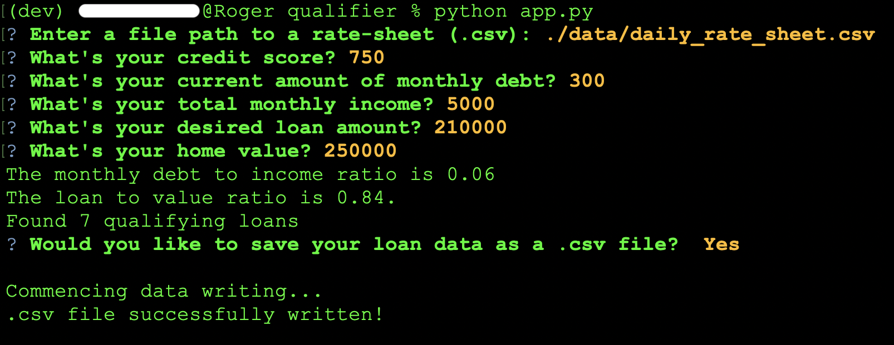
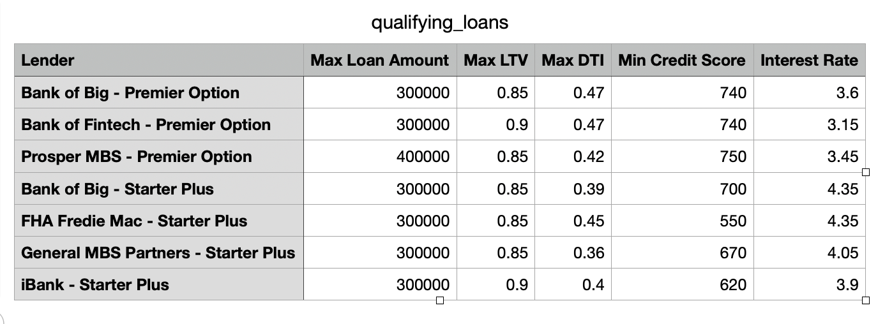

# Loan Qualifier Application

A command-line-interface application which determines available mortgage loans based upon an applicant's financial information.


---

## Technologies

Before executing the Loan Qualifier Application, ensure that the Fire, Questionary and PyTest modules are installed on your machine's Python 3.7+ development environment.

* [fire](https://google.github.io/python-fire/guide/) - CLI, entry point and help page.

* [questionary](https://pypi.org/project/questionary/) - Interactive user input, dialogs, and control flow.

* [PyTest](https://docs.pytest.org/en/latest/) - Unit testing framework.

---

## Installation Guide

Before executing the *Loan Qualifier Application*, ensure that the *Fire*, *Questionary* and *PyTest* modules are installed on your machine's *Python 3.7*+ development environment.

```
pip install fire
pip install questionary
pip install pytest
```

---

## Examples





---

## Usage

Clone repository onto your personal machine and navigate to the `qualifier` directory via CLI. A *.py* file named `app.py` will be present. With *Python 3.7*+, run the following command in the CLI,

```
python app.py
```

After launching the above command, you will be prompted to enter a path to a *.csv* file containing loan information from a selection of banks. This file in question is located in `/qualifier/data/daily_rate_sheet.csv`. When this prompt arises, enter in the following as the path input:

```
./data/daily_rate_sheet.csv
```

 Next, you will be prompted to enter in a selection of financial information to determine any qualifying loans available to you. **All numerical data is assumed to be in U.S. Dollars (USD). Do not use commas or dollar signs when inputting data!**

Your qualifying loans are now available and you will be prompted with a message indicating the number of available loans from `daily_rate_sheet.csv`. Lastly, you will be given the option to save this information into a *.csv* format. If you choose to save your loan information, it will be stored in the following directory:

```
/qualifier/data/output
```

---

## Contributors

New development created by Aaron C. Montano. **Code from Initial Commit originates from UC Berkeley FinTech Bootcamp and I do not claim original ownership nor scholarship**.

---

## License

Software tool available for public use. 
